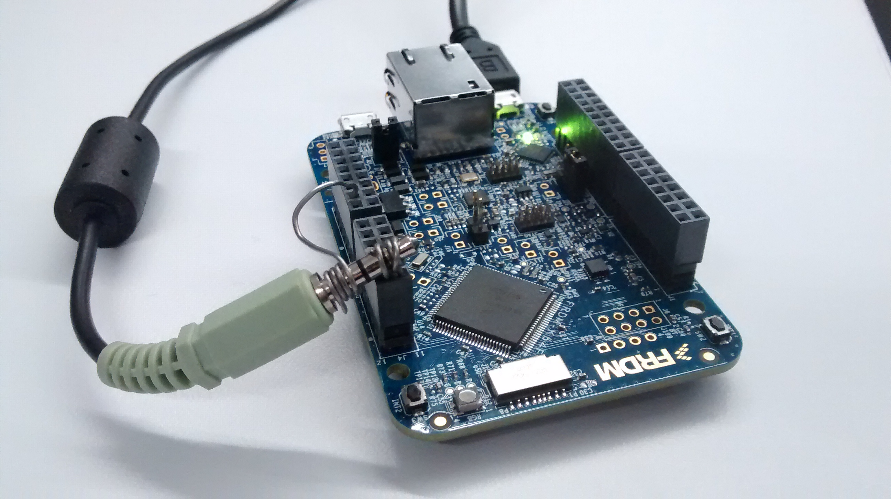

Hardcoded Player
================

Ever wanted a program that exists for the sole purpose of playing a single
sound clip over and over again on any MBED device that has a DAC with
absolutely no bells or whistles?
Then this is the program you're looking for.

How to use
----------
Assuming you have an mbed development environment set up, then creating your
hardcoded player is a simple 3 step process. If not then feel free to follow
the wonderful getting started guide over [here](https://docs.mbed.com/docs/getting-started-mbed-os/en/latest/).

1. Convert your audio into a wave file that will fit on your device. For this
I used the wonderful [pydub](http://pydub.com/) library, but feel free to use
any tool to get a 8-bit mono 8000hz wave file.

``` bash
$ ./decode.py music.mp3 music.wav
    
```

2. Dump the wave file into a C file for compilation. Don't worry if your wave file
still doesn't fit, you can specify an offset/size in bytes.
``` bash
$ ./dump.py light.wav data.h 4000 200000
```

3. Now all that's left is to compile and flash your hardcode player!
``` bash
$ make all flash
```

If you get an error like `cannot move location counter backwards`, don't worry, this
just means your file is still too big! Just try triming it down a bit.

Example
-------
Here's the program running on a [K64F](https://developer.mbed.org/platforms/FRDM-K64F/).
Doesn't it look like it sounds just like you imagine?




